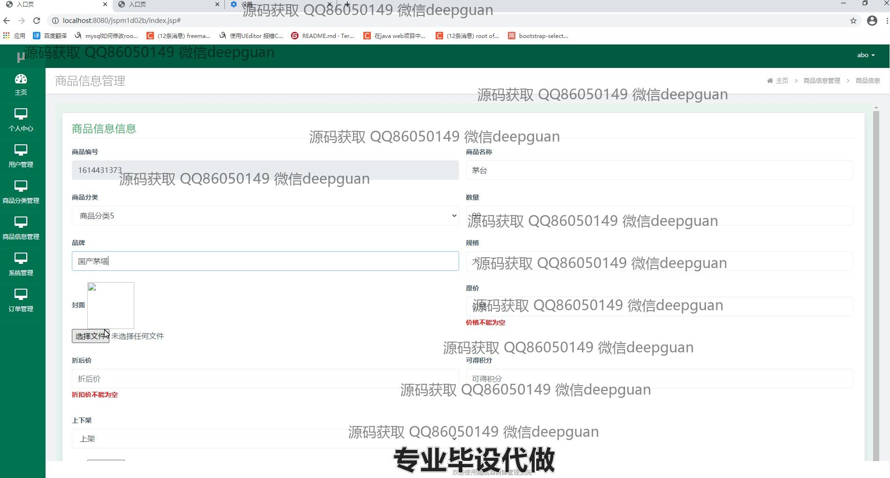
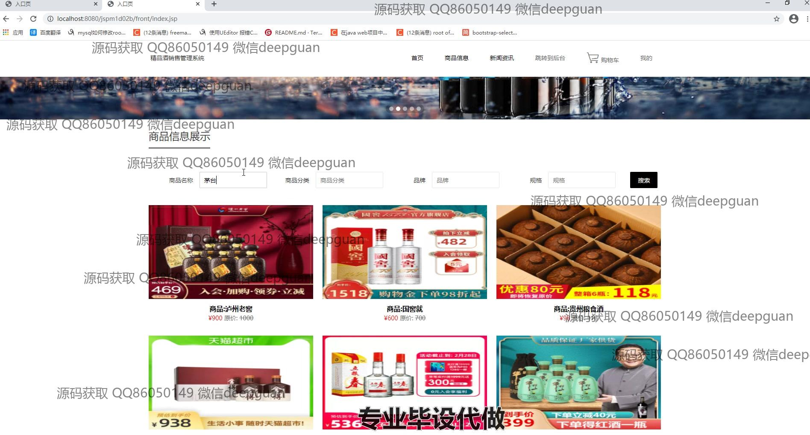
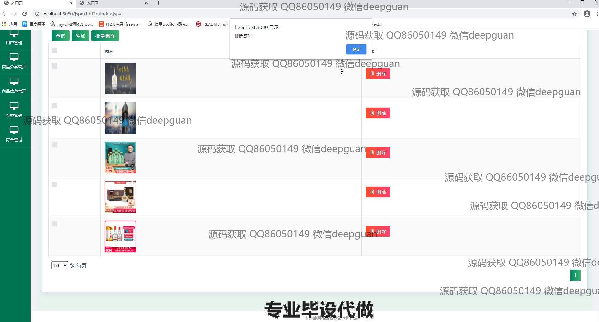
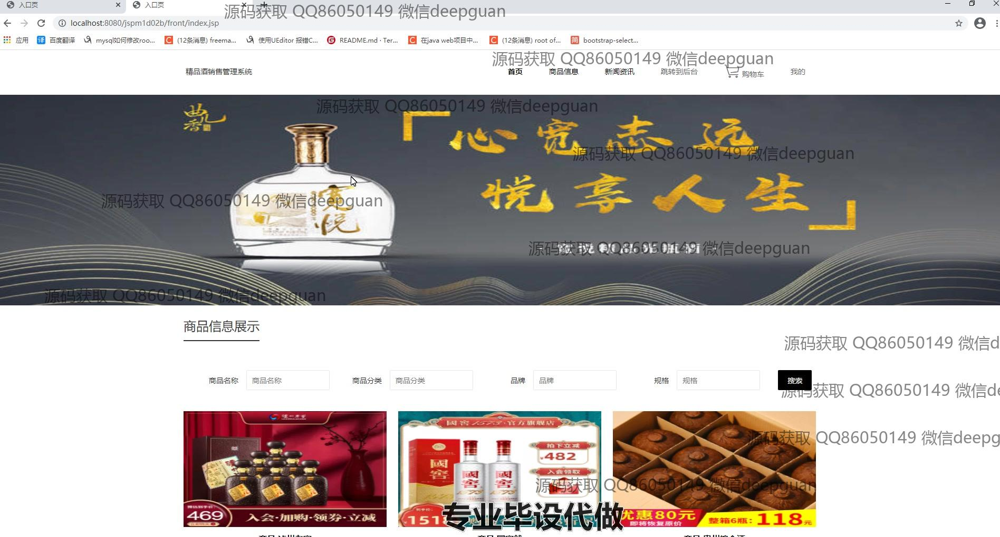

<h1 align="center">基于jsp的精品酒销售管理系统</h1>

## 简介
精品酒销售管理系统：角色分为管理员、用户；功能包括用户管理、商品信息管理、订单管理、购物车、个人中心、系统设置、导航菜单和物流管理。    --计算机毕业设计源码；毕设源码；java毕业设计源码

## 联系方式

<h3 align="center">获取完整代码与数据库文件 + 微信：deepguan QQ: 86050149 QQ群: 783742310</h3>

<h3 align="center">可帮忙远程部署 包运行成功！提供远程部署、修改代码、设计文档指导、代码讲解等服务！</h3>

## 功能介绍（完整见运行截图）
管理员：支持用户管理、商品分类管理、商品信息管理、订单管理等功能模块。提供用户信息编辑与维护，包括添加、修改、删除和批量操作。商品管理功能包含商品的上下架状态、库存调整、价格编辑以及详细信息上传。订单管理实现订单状态更新、批量删除、支付类型记录和订单查询功能。系统管理模块用于整体功能配置和后台维护。

用户：提供账户注册、登录、退出和个人信息管理功能。首页展示商品推荐、促销信息和导航栏，方便用户快速浏览与选择商品。购物车支持添加、删除商品以及结算操作，并提供订单确认和支付入口。个人中心包括订单查询、地址管理和收藏夹功能，用户可随时查看与修改个人信息。

消费者：在商品界面可以搜索、查看商品分类及详情，包括品牌、规格、价格等信息。支持直接将商品加入购物车或收藏，并通过订单确认页面完成购买。支付流程模拟支持多种支付方式，页面直观易用，满足消费者购买与支付需求。

访客：访问网站时可浏览首页和商品详情，查看促销活动、特价商品和推荐商品信息。通过注册功能成为用户后，可享受完整系统功能，操作简便，提升购买体验。

## 运行截图

本代码来源于网络,仅供学习参考使用!

